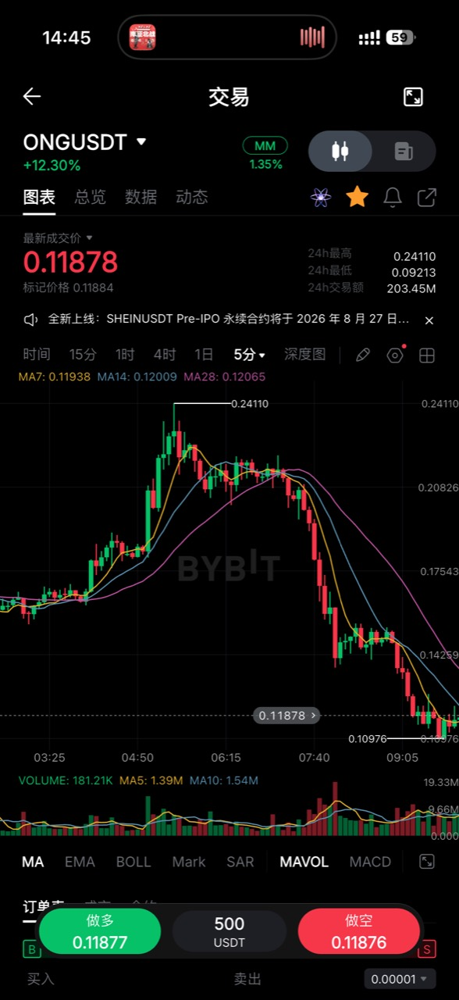

## 用户原话（2026-08-27）

> 这个强势股的见顶，最后拉升幅度比较大，后面五分钟小反弹直接中位都没过去，在后面直接底部横盘很久，弱势确立，后面就大跌了，这种形态先收藏下

## 原始截图

## 图中可见事实

- 标的为 Bybit `ONGUSDT`，截图周期为 5 分钟。
- 价格在强势上涨末段出现明显加速，图中高点约为 `0.24110`。
- 冲高后发生第一段快速下跌，随后反弹力度偏弱。
- 弱反弹后价格在相对低位横盘，短中期均线逐渐转为压制。
- 横盘下沿失守后出现第二段明显下跌。

## 待验证形态假设

1. 前置筛选：标的是当日涨幅较大、波动较大的强势币。
2. 见顶提示：上涨末段的单段拉升幅度显著放大。
3. 弱势确认一：第一次快速回落后的 5 分钟反弹未能越过参考跌幅的中位。
4. 弱势确认二：价格在第一次下跌后的低位持续横盘，反弹高点受压。
5. 延续触发：低位横盘区间向下破位后，空头趋势再次加速。

## 待定项

- “中位”按最后一段下跌、见顶至第一低点，还是其他锚点计算：待定。
- “最后拉升幅度比较大”的量化标准：待定。
- “底部横盘很久”的最少 K 线根数和最大振幅：待定。
- 入场是弱反弹失败、横盘期间反抽，还是横盘下破确认：待定。
- 止损位置、失效条件、止盈方式和仓位大小：待定。

## 当前边界

- 本次只收藏形态和原始截图。
- 暂不写入线上策略，不触发自动下单。
- 后续出现同类案例时先补充样本，再决定是否量化和回测。

## 研究链路

见 [timeline.md](timeline.md)。
