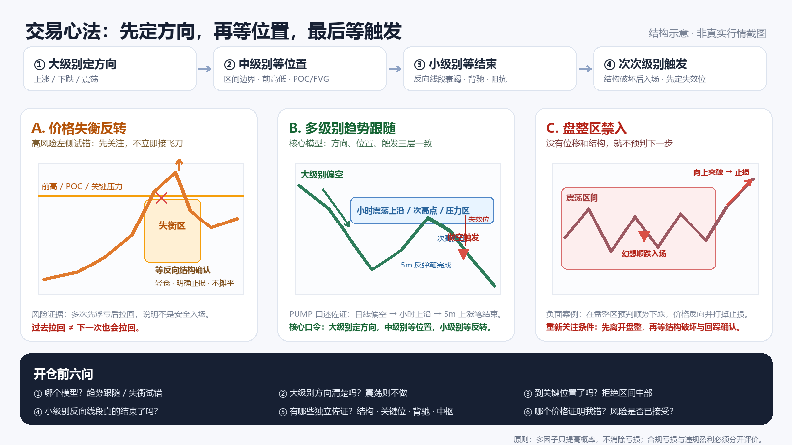

## 用户原话（2026-08-27）

> 关于操纵买卖的这一块，我觉得节奏比较稳、比较顺的时候，就是我是在价格失衡区的时候去尝试找机会。也并不是说马上去介入吧。就价格失衡，什么叫价格失衡？快速拉升，对吧？关键位打破，快速拉回。就这些失衡区才是我需要关注的点。最后一笔，这笔交易呢，我是在一个盘整区介入的。幻想它会在盘整区进行一个顺势下跌，但实际上没有，反倒是扭头往上了，并且打掉了我的止损。所以这一块的话，我觉得是一个教训。就是盘整区还是不要介入，就是你的开仓点必须还是要价格失衡区价格失衡区。
>
> 一个是价格失衡区，就相当于是接飞刀。你可以认为这个其实有点风险，几次我都是亏损之后又拉回来，所以可以作为经验之一，教训也要记住。
>
> 其次就是我 PUMP 盈利的这一笔。我是建在小时线级别的震荡区间上沿，因为我整体预判它日线级别是一个下跌趋势，所以这个小时线级别的震荡区间回踩到上沿部分，那就是我要做顺势而为的买入点。
>
> 我觉得这个操作是没有问题的，并且这应该也是我后面跟随趋势做交易的核心思路：大级别先定了方向之后，再在小级别找买点。至于小级别、次级别怎么找买点，次级别就找一个相对安全的点也就是说，次级别可能就是完成了一笔。因为小时线是下跌趋势，而 5 分钟线其实是完成了一笔上涨的线段，并且已经到了前期的压力位。
>
> 所以在这个位置，就相当于我要在次级别去寻找次次级别中，趋势可能终结或处于压力位的位置去尝试做空，然后跟随大趋势的判断去做交易。这样做起来我觉得会比较安心一点，因为我研判大趋势是往下跌的。
>
> 关于大趋势下跌的研判，以我目前的经验来看，比如 15 分钟线出现了趋势被打破的结构（高点不破新高，低点破新低）。这种结构出现之后，价格又震荡回次高点附近，这时候就可以切入。
>
> 当然，这也有失败的概率。只是目前我还没遇到过，以后遇到了肯定也会有损失。也就是说，趋势转换的结构出来之后，如果它通过震荡，把这个趋势转化为了一个震荡区间，后面再走出一波向上的行情，那也是有可能的。
>
> 这里其实就是一个概率问题，并没有百分之百。做交易其实就是和概率做搏斗，你每次的下注方向，都要往概率最大的方向去下，这样就行了。还有一点，假设你定的趋势是往上或往下的，但这个趋势次级别终点（也就是结束的位置），你最好还是比较精确地定位一下。
>
> 比如说往次级别的结构看，有没有走出一个背驰、两中枢这种下跌阻抗形态，然后又到了关键位？我们要结合多种形态组合去研判。

## 结构示意图

> 图为依据用户口述制作的结构示意，不是 PUMP 或其他标的的真实 K 线，也不能作为回测证据。

## 图中可见事实

### 用户提供的实盘佐证

1. **盘整区止损单（负面案例）**：入场发生在盘整区，依据是“幻想价格会顺势下跌”；实际价格向上反转并触发止损。该案例支持“盘整区不预判方向”的纪律，但没有提供标的、时间、截图和成交明细。
2. **PUMP 盈利单（正面案例）**：用户先判断日线偏空，再等价格回到小时线震荡区间上沿；5 分钟反弹完成并到达前期压力位后尝试做空，结果盈利。该案例支持“大级别定方向、中级别等位置、小级别找触发”的流程，但目前缺少原始图和成交数据。
3. **失衡区试错经验（风险案例）**：数次左侧尝试都曾先产生浮亏，随后才拉回。结果虽然回来了，但过程说明失衡区反转属于接飞刀式试错，不能把“过去拉回”推断成“以后必然拉回”。

### 证据边界

- 本条只有用户实盘回忆，没有原始 K 线、成交时间、手续费、滑点、止损距离或样本总数。
- 盈利只能证明这一次结果为正，不能单独证明规则具备稳定统计边际。
- 止损只能证明这一次盘整区预判失败，不能单独证明所有盘整突破都不可交易；这里沉淀的是用户当前最适合执行的纪律。

## 待验证形态假设

### 一、先把两种交易模型彻底分开

| 模型 | 定位 | 核心依据 | 入场态度 | 风险级别 |
|---|---|---|---|---|
| 多级别趋势跟随 | **核心模型** | 大级别方向 + 中级别关键位置 + 小级别反向线段结束 | 等确认后顺势介入 | 相对可控 |
| 价格失衡反转 | **辅助试错模型** | 快速位移、关键位、前高/前低、POC、FVG 等共振 | 只关注，不立即介入；确认后轻仓 | 高风险 |
| 盘整区预判 | **禁入场景** | 只有主观方向，没有位移和结构确认 | 不开仓，等价格离开盘整再重新判断 | 不应承担 |

不能用“失衡反转”的理由进场，再用“趋势跟随”的理由扛单；每笔交易在开仓前必须写清楚属于哪一个模型。

### 二、核心流程：大级别定方向，中级别等位置，小级别等结束

1. **大级别定方向**
   - 先判断上涨、下跌还是无序震荡。
   - 下跌结构的参考定义：高点不再创新高，同时低点跌破前低；上涨结构镜像处理。
   - 如果方向仍然模糊或已经转换成震荡，不交易。

2. **中级别等关键位置**
   - 下跌大方向中，等待反弹到小时线震荡区间上沿、次高点、前期压力、POC、FVG 或中枢边界附近。
   - 上涨大方向中，等待回调到对应支撑位置。
   - 不在区间中部追价，不因为“应该继续跌/涨”而提前下注。

3. **小级别识别反向线段接近结束**
   - 例如大级别偏空时，5 分钟已经完成一笔上涨并到达压力位。
   - 继续下钻到次次级别，观察上涨动能是否衰竭，是否出现背驰、两中枢后的阻抗、假突破收回、次高点受压或低点破位。

4. **触发后顺大趋势开仓**
   - 做空示例：小级别形成更低高点，随后跌破最近低点；反抽无法收回关键位时介入。
   - 做多镜像处理。
   - 原话中的“顺势买入点”结合上下文实际指“顺势开仓点/做空点”；原话保留，规则按做空场景解释。

5. **入场前写清失效条件**
   - 做空时，价格重新站上用于确认的次高点、区间上沿或关键压力，说明当前判断失效。
   - 趋势转换后若价格长期横盘并向反方向突破，要承认趋势可能已转为震荡或反转，不能继续用旧方向解释新行情。

### 三、价格失衡区：先关注，后确认，轻仓试错

价格失衡的观察线索包括：

- 单根或连续 K 线实体显著大于此前常态，形成快速位移或价格真空；
- 快速突破关键位后不能延续，迅速拉回；
- 失衡发生在前高、前低、POC、FVG、中枢边界等位置；
- 次次级别出现速度衰减、背驰、反向分型或结构破坏。

执行纪律：

- 看到失衡只加入关注，不立即接飞刀；
- 没有反向结构确认，不开仓；
- 即使确认，也按高风险模型轻仓；
- 止损必须放在结构失效点，不能因为过去“亏损后拉回”就放弃止损；
- 如果价格继续加速，说明失衡尚未结束，退出而不是加仓摊薄。

### 四、盘整区禁入规则

满足以下特征时，默认视为盘整并禁止预判式开仓：

- 高低点相互重叠，没有连续的结构推进；
- 区间中部来回波动，离关键上下沿都较远；
- 没有明显位移、突破收回或小级别趋势终结信号；
- 入场理由只能表达为“我觉得它接下来应该顺势走”。

允许重新关注的条件：价格先离开盘整区，出现明确位移或结构破坏，再回到关键边界完成确认。

### 五、开仓前六问

1. 我做的是**趋势跟随**还是**失衡反转试错**？
2. 大级别方向是否清楚？如果是震荡，为什么还要做？
3. 当前是否已经到达中级别关键位置，而不是区间中部？
4. 小级别反向线段是否真的完成，还是仍在加速？
5. 有哪些相互独立的佐证：结构、关键位、背驰、中枢、POC、FVG、假突破收回？
6. 哪个价格出现就证明我错了？这一笔风险是否在开仓前已经接受？

### 六、概率原则

- 结构转换是提高概率的证据，不是必然结果。
- 多因子共振的作用是筛掉低质量交易，不是消除亏损。
- 盈利单也要检查是否符合纪律；亏损单也可能是合规交易。
- 评价重点应是：方向、位置、触发、失效和仓位是否一致，而不是只看最后赚没赚钱。

## 待定项

1. “快速位移/价格失衡”的量化阈值：实体相对 ATR、过去 N 根均值或百分位如何定义？
2. “高点不创新高、低点破前低”的结构确认需要几笔、几根 K 线和多少最小突破幅度？
3. 15 分钟、1 小时和日线发生冲突时，哪一级拥有最终否决权？
4. “盘整区”的最小持续时间、最大振幅和中部禁入范围如何量化？
5. 背驰、两中枢、POC、FVG、前高/前低分别是必选条件还是加分项？
6. 趋势跟随模型和失衡试错模型应采用怎样不同的仓位与最大止损？
7. 补齐 PUMP 盈利单、盘整止损单及至少 20 个同类样本的原图和成交明细后，再评估命中率、期望值与失效分布。

## 当前边界

- 本条是交易心得与筛选框架，状态为“研究中”，不是已经验证的机械策略。
- 结构图是示意图，不能代替真实行情、成交记录或回测。
- 本次不修改任何线上策略、自动下单、仓位、杠杆、止盈或止损设置。
- 后续每出现一个真实案例，都应追加到时间线，并区分“符合纪律但亏损”和“偏离纪律”。

## 研究链路

见 [timeline.md](timeline.md)。
