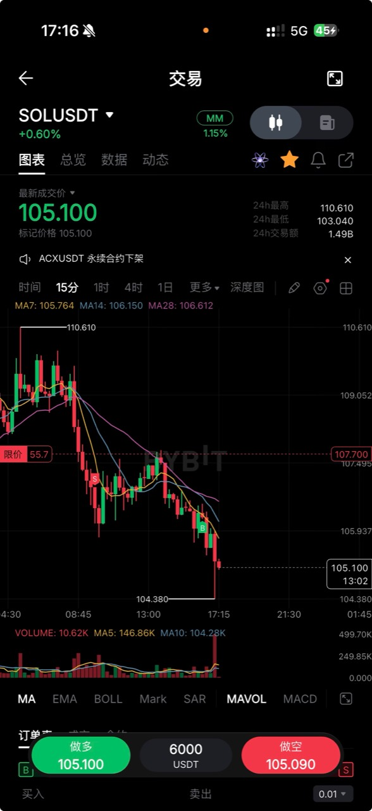

## 用户原话（2026-08-28）

> 这个图行的经验教训参考一下：本身的话，我看好趋势是往下走的，并且才走了一点点的趋势，然后被五分钟的两根 K 线，因为前面是个小低点，这边相当于是低点突破又小拉回，就这样子就把我吓出去了。我以为它可能会再谈到上述这个区间上沿的位置。
>
> 所以这块的话，到底是我太谨慎了，还是我操作有问题？

## 原始截图

## 图中可见事实

- 截图为 Bybit `SOLUSDT` 的 15 分钟图；截图时价格为 `105.100`，画面可见高点 `110.610`、低点 `104.380`。
- 画面内价格总体形成更低的高点和更低的低点，并位于 MA7、MA14、MA28 下方；截图显示 MA7=`105.764`、MA14=`106.150`、MA28=`106.612`。
- 图中先出现一个 `S` 标记，随后在更低位置出现一个 `B` 标记；`B` 标记出现后，价格继续向下走到 `104.380`。这些标记是否精确对应本次开仓与平仓，仍以 Bybit 成交记录为准。
- 用户说明，实际促使自己离场的是 5 分钟级别两根 K 线：前方小低点被突破后又出现小幅拉回，担心价格重新反弹到上方区间上沿。
- 截图本身是 15 分钟图，没有展示用户所说两根 5 分钟 K 线的完整结构，因此不能从本图单独确认 5 分钟信号强弱。

## 待验证形态假设

### 当前更接近“离场级别错配”，不是单纯太谨慎

如果开仓依据是 15 分钟下跌结构，那么 5 分钟的两根反弹 K 线最多先构成风险警告，不能天然成为全平条件。全平需要看到原持仓逻辑的失效证据，例如：

1. 价格重新站稳关键跌破位或原计划中的区间上沿；
2. 5 分钟不只是拉回，而是先突破最近一个有效次高点，再回踩形成更高低点；
3. 该反转继续放大，使 15 分钟最后一个有效次高点被突破，或 15 分钟收盘重新站回预先定义的失效区。

从当前 15 分钟截图看，更低高点、更低低点和均线下压尚未出现明显破坏。因此，若当时没有其他未展示的强反转证据，直接全平更像是用小级别噪声否决大级别逻辑。

### 谨慎本身没有错，问题可能是没有提前规定“谨慎到什么程度”

- 如果原计划本来就是用 5 分钟结构移动止损，那么离场可以是合规交易，不能因为后来继续下跌就倒推它一定错误。
- 如果计划以 15 分钟持仓，却临场因为害怕把 5 分钟小反弹改成全平依据，则属于执行变形。
- 如果仓位大到两根 5 分钟 K 线就明显影响判断，需要同时检查仓位是否超过心理承受范围；这一点目前没有足够证据。

### 候选离场纪律

1. **开仓级别决定全平级别**：15 分钟逻辑开仓，原则上由 15 分钟失效条件负责全平；5 分钟只负责预警和优化。
2. **预警与失效分开**：5 分钟出现疑似反转时，可以减仓三分之一、收紧保护止损或停止加仓，不必立刻清掉全部趋势仓。
3. **破低拉回不等于反转**：只拉回小低点、但没有突破最近有效次高点并形成更高低点，先按跌破后的回抽处理。
4. **结构止损跟随有效次高点**：空单保护位跟随最后一个已确认的有效次高点或计划中的区间上沿，不跟随每一个微小低点。
5. **分两段管理仓位**：第一部分在既定支撑位或达到首个 R 倍数时兑现；剩余趋势仓只在结构失效时退出，减少“全拿或全丢”的心理压力。
6. **不用结果审判过程**：后续跌到 `104.380` 只能说明这次提前离场损失了后续空间，不能证明任何 5 分钟拉回都应该忽略。

## 待定项

- 本次做空的准确开仓价、平仓价、时间、仓位、手续费和实际盈亏。
- 触发离场的两根 5 分钟 K 线截图及其前后至少 20 根 K 线。
- 开仓前是否写过明确的止损、止盈、移动保护和全平条件。
- 用户所说“上述区间上沿”的准确价格边界。
- `S`、`B` 标记是否就是本次真实成交点。
- 累积同类案例后，比较“5 分钟预警即全平”“先减仓”“等待 15 分钟失效”三种管理方式的 MFE、回撤和最终 R。

## 当前边界

- 这是单个实盘案例的纪律复盘，不是经过样本验证的机械规则。
- 本案例是 `008-multi-timeframe-trend-imbalance-playbook` 的第一条真实离场样本。
- 本次只补充研究档案，不修改策略代码、线上监控、仓位、止盈止损或自动下单设置。

## 研究链路

见 [timeline.md](timeline.md)。
